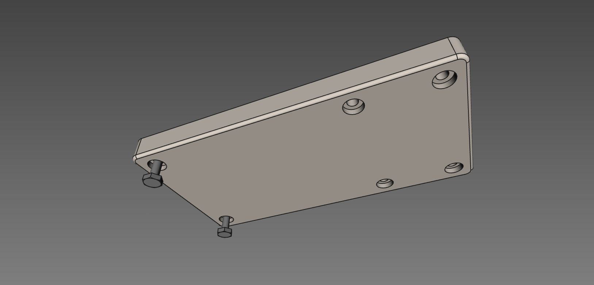
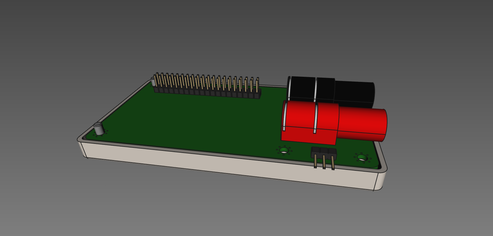
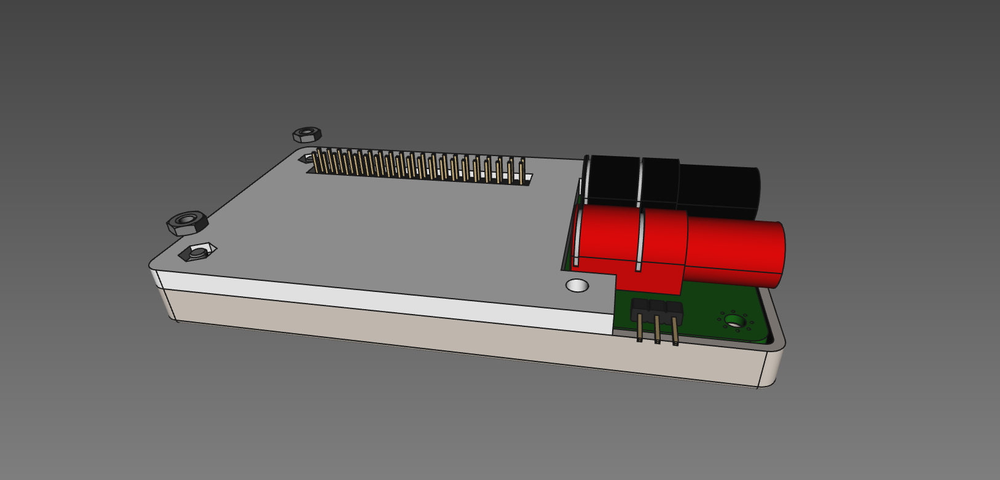
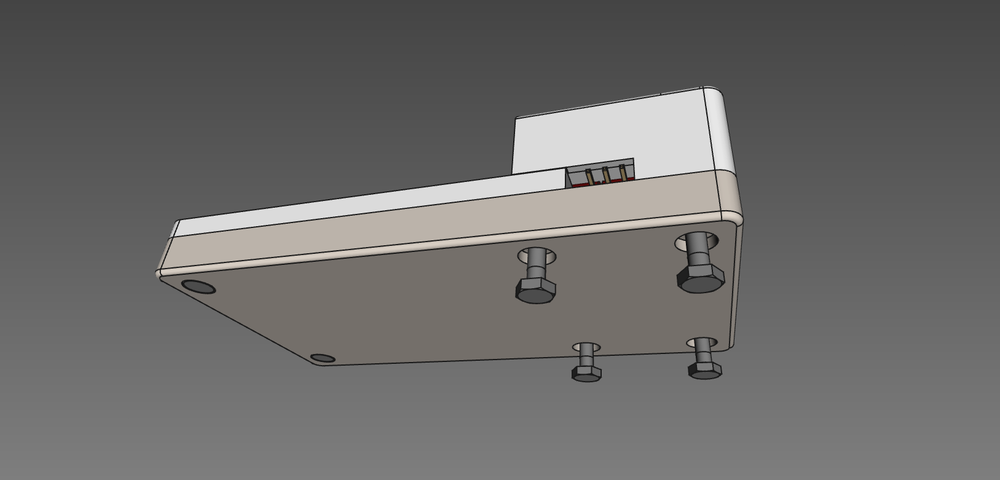
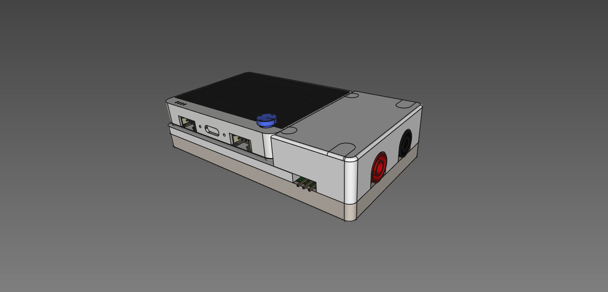

Serial-Wio
==========

Turn your WioTerminal into an automagic UART terminal !

Features
--------

* Automatic baudrate/parity detection
* On-screen UART log
* USB UART bridge

Case printing and assembly
--------------------------

A custom case has been designed to fit the WioTerminal, it allows normal multimeter probes
to be used and protects the electronics.

The case is made of 3 independent parts that may be 3d printed with any decent 3d printer:

* a bottom part that holds 6 M3 hex screws
* a middle part that holds 2 M3 hex nuts
* a top part

Extra materials required:

* 2x 10mm M3 screws
* 4x 15mm M3 screws
* 2x M3 nuts

Printing the case
~~~~~~~~~~~~~~~~~

Top part must be printed upside down to get best results, without supports. Bottom part must be
printed with supports to get the screws' heads holes correctly printed.

Assembling the case
~~~~~~~~~~~~~~~~~~~

First, insert 2x 10mm M3 screws in the bottom part as shown below:

Then, place the custom PCB inside the bottom part:

Place on top of this the intermediate lid and add two M3 nuts. Tighten them just enough to hold the lid
in place. 

Last, place the top lid and screw 4x 15mm M3 screws to maintain it in place, as shown below:

You can now connect your WioTerminal to your SerialWio module:

Custom PCB
----------

We designed a custom PCB that extends WioTerminal capabilities designed with KiCAD v5.
Design files are available in `PCB_design_files` folder, including 3D models and custom
fingerprints.

Gerber files
~~~~~~~~~~~~

Gerber files are also provided in the `PCB_design_files/gerber` directory, as well as the
`kicad_pcb` file if you want to order it on OSHPark. 

Bill of materials
~~~~~~~~~~~~~~~~~

* Q1, Q2, Q3: SOT23 MMBF170 N-channel MOSFET 60V 225mW (Ref LCSC: C130879)
* R1, R2, R3: R0805 10 Kohm (Ref LCSC: C269742)
* TEST_SIG1: 4mm banana female plug red (Farnell: SWEB 8094 AU/RT)
* TEST_GND1: 4mm banana female plug black (Farnell: SWEB 8094 AU/SW)
* 3 contacts (1 row) 2.54mm right-angled header

